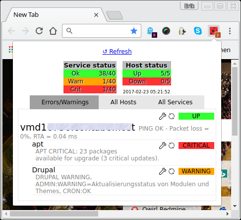

Imoin
=====

This is a browser add-on that monitors your Nagios or Icinga instance.

Homepage is at https://ewus.de/en/sw/imoin

Use one of these browsers:

* Firefox 48 or greater
* Chrome (current stable)

Supported versions:
-------------------

* Icinga 2
* Nagios Core 4.0.7+
* Nagios 3+

Done
====

☑ Basic add-on for Firefox/Chrome  
☑ Regularly check the status  
☑ Show an error or a warning toolbar button if something is happening  
☑ Show a totals table when you click the toolbar button
☑ Show more details for host checks  
☑ Show more details for service checks  
☑ Reschedule next service check  
☑ Reschedule next host check  
☑ Support for Nagios Core 4.0.7 and later  
☑ Support multiple instances  
☑ Play configurable sounds on events  

To do
=====

☐ Provide links to the monitoring instance (e.g. clicking on a service name opens that service on the icinga instance)  
☐ Filter by a hostgroup  
☐ Filter by hostgroup, contact, (...?), on the fly  
☐ Localization  
